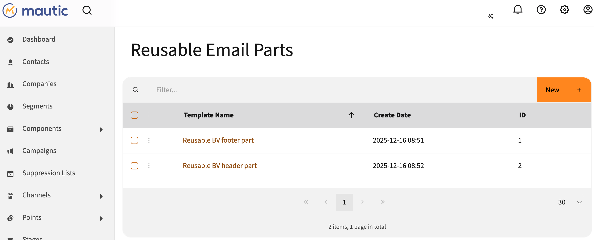
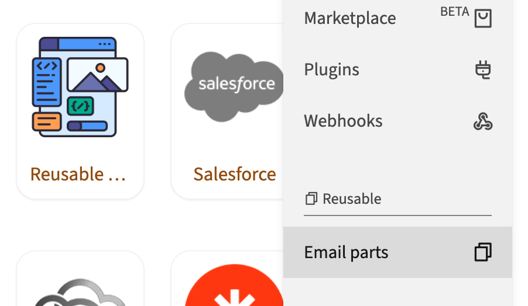
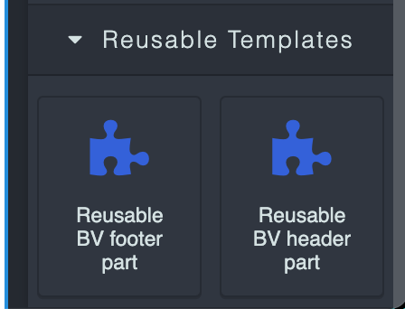

# Mautic Reusable Email Parts Bundle

A Mautic integration for managing reusable HTML email templates that can be used across different emails and campaigns.

## Features

- Create and manage reusable HTML email parts
- Integration with Mautic's settings panel
- Enable/disable functionality via integration settings
- Simple interface for template creation and editing
- Store and organize template content
- Menu item appears under "Channels" section
- GrapeJS integration for drag-and-drop email building



## Installation

1. Copy the `MauticReusableTemplatesBundle` folder to your Mautic's `plugins` directory
2. Clear Mautic's cache:
   ```bash
   php bin/console cache:clear
   ```
3. Run the database migration:
   ```bash
   php bin/console doctrine:migrations:migrate
   ```
4. Enable the integration:
   - Go to Settings > Plugins
   - Find "Reusable Email Parts"
   - Click to configure
   - Toggle the "Published" switch to enable
   - Click "Save & Close"

## Usage

After installation and enabling the integration, you'll find the "Reusable" menu in your Mautic admin navigation with "Email parts" as a submenu item.



### Creating an Email Part

1. Navigate to "Reusable" → "Email parts" in the admin menu
2. Click "New" to create a new email part
3. Enter a name for your email part
4. Add your HTML content in the content field
5. Click "Save" to store the email part

### Managing Email Parts

- **Edit**: Click on an email part name or use the edit action to modify an existing part
- **Delete**: Use the delete action to remove email parts you no longer need
- **Search**: Use the search bar to find specific email parts by name

### Using in GrapeJS Email Builder

Once you've created reusable email parts, they will appear in the GrapeJS email builder under the "Reusable Templates" category. Simply drag and drop them into your email.



## Database Structure

The plugin creates a `reusable_templates` table with the following fields:

- `id`: Primary key
- `name`: Template name (varchar 255)
- `content`: HTML content (text)
- `created_at`: Creation timestamp
- `updated_at`: Last update timestamp
- `updated_by`: User ID who last updated the template

## Access URL

The plugin is accessible at: `/s/reusabletemplates`

## Cronjob Setup

To enable automatic email content updates when templates change, add the following cronjob to run every minute:

```bash
* * * * * php /path/to/mautic/bin/console mautic:reusabletemplates:process
```

Replace `/path/to/mautic` with your actual Mautic installation path.

### What the cronjob does:
- Checks for templates marked as "changed"
- Processes each changed template
- Updates all emails using those templates (logic to be implemented)
- Resets the "changed" flag after processing

### Manual execution:
You can also run the command manually:

```bash
php bin/console mautic:reusabletemplates:process
```

## Version

1.0.0

## Author

Frederik Wouters

## License

MIT
